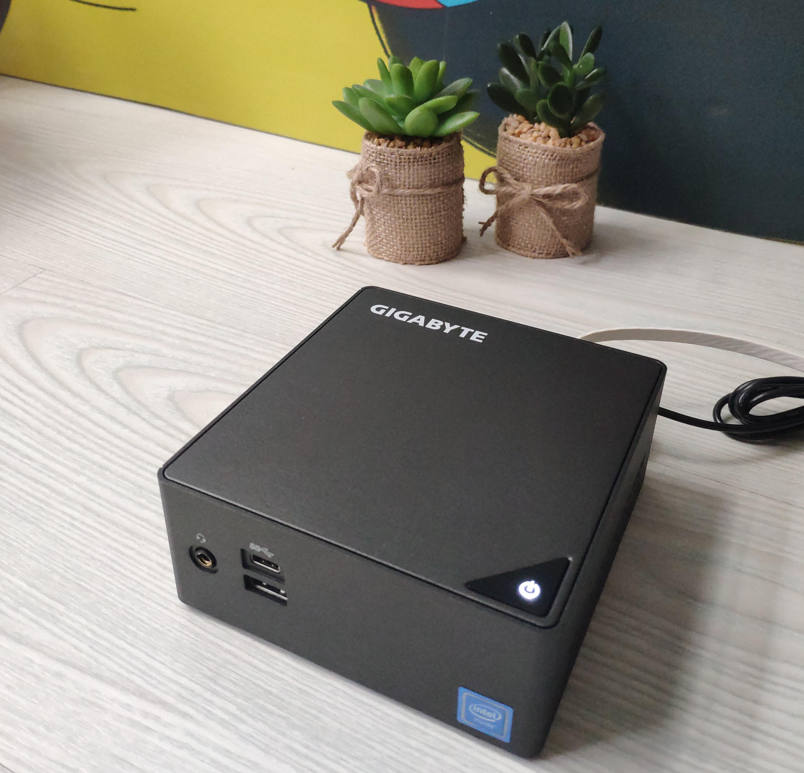

This guide is written for professional market makers & traders to build an always-on xud node with a powerful Mini PC.



Two options are available:

1. **Light setup** using [Neutrino](https://github.com/lightninglabs/neutrino) and [Infura](https://infura.io/). This keeps the setup light-weight, but requires to trust entities like [Infura](https://infura.io/).
2. **Full setup** using [bitcoind](https://github.com/bitcoin/bitcoin/), [litecoind](https://github.com/litecoin-project/litecoin) and [geth](https://github.com/ethereum/go-ethereum). Requires more resources and an SSD, but keeps the setup trustless.

## Light Reference Shopping List (Europe): 200 €
* [GIGABYTE GB-BLCE-4105 BRIX](https://www.computeruniverse.net/en/gigabyte-gb-blce-4105-brix): 148,99 €
* [4 GB RAM](https://www.computeruniverse.net/en/crucial-4gb-ddr4-so-dimm-ct4g4sfs824a-2400mhz-ram): 20 €
* [120GB M.2 SSD](https://www.computeruniverse.net/en/wd-green-ssd-m2-2280-120gb): 28 €
* [USB stick for backups](https://www.amazon.es/dp/B00TPG6P22/): 3,99 €
   * Any >1GB USB stick will do.
   * A NAS/Samba share works too.

## Full Reference Shopping List (Europe): 500 €
* [GIGABYTE GB-BLCE-4105 BRIX](https://www.computeruniverse.net/en/gigabyte-gb-blce-4105-brix): 148,99 €
  * Alternative: [ODYSSEY - X86J4105864](https://www.seeedstudio.com/ODYSSEY-X86J4105800-p-4445.html), same platform but needs separate case+power
  * Alternative: [ODROID-H2](https://www.hardkernel.com/shop/odroid-h2/), same platform but sold out since ages and needs separate case+power
* [32 GB RAM](https://www.computeruniverse.net/en/kingston-hyperx-impact-32gb-ddr4-so-dimm-ram-2): 140 €
  * Alternative: [List of compatible RAM](https://wiki.odroid.com/odroid-h2/hardware/ram)
* [2TB SSD](https://www.computeruniverse.net/en/sandisk-ssd-plus-25-2tb): 210 €
  * Alternative: [240GB M.2 SSD](https://www.computeruniverse.net/en/wd-green-ssd-m2-2280-240gb) + [2TB HDD](https://www.computeruniverse.net/en/seagate-firecuda-compute-st2000lx001-sshd-2tb): 120 €
* [USB stick for backups](https://www.amazon.es/dp/B00TPG6P22/): 3,99 €
   * Any >1GB USB stick will do.
   * A NAS/Samba share works too.

## Setup

1. [Download Ubuntu Server](https://ubuntu.com/download/server) onto your computer. Any other linux distribution supporting docker is also fine.
2. Insert a USB Stick into your computer and [create the a bootable USB Stick](https://ubuntu.com/tutorials/tutorial-create-a-usb-stick-on-ubuntu) with the ubuntu image you just downloaded.
3. Open your Mini PC, plug in RAM & drives, close it, connect it to your router via ethernet cable and to a power supply. Connect a screen via HDMI, a USB keyboard, the created bootable USB Stick, fire the Mini PC up and follow the the inital setup instructions.
4. Update ubuntu via `sudo apt update && sudo apt upgrade`
5. Install docker following the [official instructions](https://docs.docker.com/install/linux/docker-ce/ubuntu/). At the time of writing, ubuntu 19.10 was still not supported in the official docker repos. If you see an error along the lines `'docker-ce' has no installation candidate` in step 4 of the docker instructions, run this instead:
```bash
sudo add-apt-repository \
   "deb [arch=amd64] https://download.docker.com/linux/ubuntu \
   disco \
   stable"
```
6. Add new user `xud`:
```bash
ubuntu@ubuntu:~$ sudo adduser xud
Adding user `xud' ...
Adding new group `xud' (1001) ...
Adding new user `xud' (1001) with group `xud' ...
Creating home directory `/home/xud' ...
Copying files from `/etc/skel' ...
New password: 
Retype new password: 
passwd: password updated successfully
Changing the user information for xud
Enter the new value, or press ENTER for the default
	Full Name []: 
	Room Number []: 
	Work Phone []: 
	Home Phone []: 
	Other []: 
Is the information correct? [Y/n] ubuntu@ubuntu:~$ Y
```
7. Add the `xud` user to the sudo group (advanced users can skip this and use another user to run sudo commands), the docker group and test if docker is working:
```bash
ubuntu@ubuntu:~$ sudo usermod -aG sudo xud
ubuntu@ubuntu:~$ sudo usermod -aG docker xud
# switch to user xud
ubuntu@ubuntu:~$ sudo su - xud
xud@ubuntu:~$ docker run hello-world
Hello from Docker!
This message shows that your installation appears to be working correctly.
```
8. Looking good! Optionally, add an alias to enter your xud environment by simply typing "xud":
```bash
xud@ubuntu:~$ sudo nano ~/.bash_aliases
# add the line
alias xud='bash ~/xud.sh'
# CTRL+S, CTRL+X. Then run
xud@ubuntu:~$ source ~/.bashrc
```
9. Connect the USB stick to your machine and set it up. It is very important to do this for a mainnet setup (given you do not want to loose money)!
```bash
# check the USB stick's path with
xud@ubuntu:~$ ls -la /dev/ | grep sd
crw-------  1 root root      2,  61 Dec  3 16:27 ptysd
brw-rw----  1 root disk      8,   0 Dec  3 16:27 sda
brw-rw----  1 root disk      8,   1 Dec  3 16:27 sda1 #this is your USB Stick
crw-------  1 root root      3,  61 Dec  3 16:27 ttysd
# set it to automount via fstab
xud@ubuntu:~$ sudo nano /etc/fstab
# add the line
/dev/sda1 /media/USB ext4 defaults 0 2
# CTRL+S, CTRL+X. Then mount it
xud@ubuntu:~$ sudo mkdir /media/USB
xud@ubuntu:~$ sudo mount -a
# check if mounting worked
xud@ubuntu:~$ df -h
# make sure xud can use it
xud@ubuntu:~$ sudo chown xud:xud /media/USB
```
**DONE!** Continue [here](Market%20Maker%20Guide.md#the-setup).
