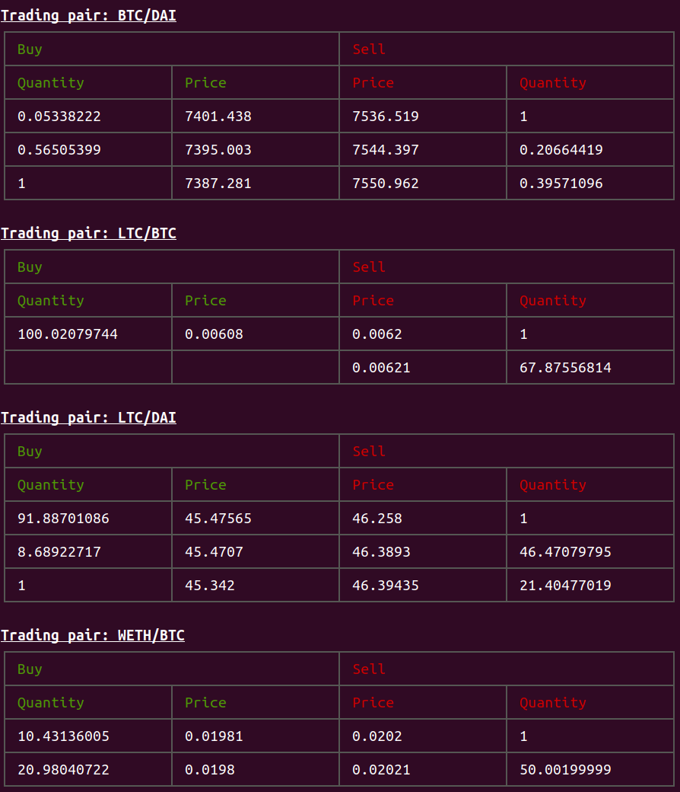

# XUD Documentation

## Introduction

`xud`, the Exchange Union Daemon, is the open-source node software powering [Exchange Union](https://www.exchangeunion.com/), a decentralized exchange (DEX) built on the [Lightning](http://lightning.network/) and [Raiden](https://raiden.network/) network.

The vision is to bring individuals and exchanges onto the same network and form one, global liquidity pool. This gives users a choice to either trade directly on the DEX by running `xud`, managing private keys and software stack, *or* to conveniently trade via a trusted exchange. Exchanges participating in the network have access to the network's aggregated liquidity and can provide deeper order books and new trading pairs to their users.

## Features:
* Unstoppable peer-to-peer trading.
* Instant settlement.
* No central point.
* No middleman.
* No KYC.
* Support for individual traders and exchanges.
* Market makers earn fees.
* User has complete control over private keys.
* Tor by default.
* Integration and simplified control of [lnd](https://github.com/lightningnetwork/lnd) and [raiden](https://github.com/raiden-network/raiden) clients.
* Decentralized order book to locally aggregate orders from the network.
* Local matching engine to match new local orders with existing local and remote orders
* Instant order settlement via atomic swaps with remote peers.
* Peer-to-peer networking with and discovery of other nodes.
* gRPC API to serve other applications, also accessible via the command-line interface `xucli`.

## API & Code Documentation

Read the `xud` API documentation [here](http://api.exchangeunion.com) and code documentation [here](http://typedoc.exchangeunion.com/).

## Support & Community

Comments, questions, and any development-related discussions are welcome in our [Discord chat](https://discord.gg/YgDhMSn)!