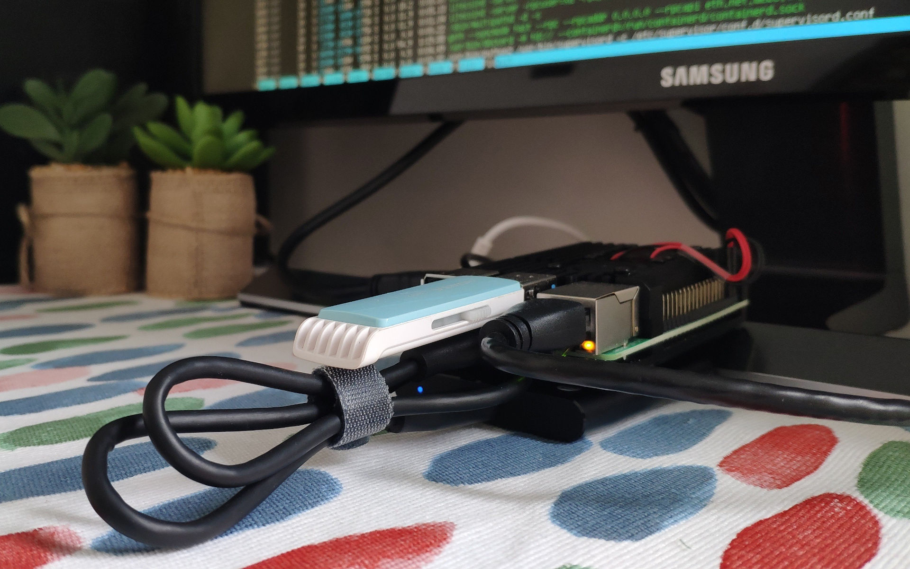

This guide is written for market makers & traders to build their own xud-in-a-box with a Raspberry Pi.



Two options are available:
1. **Light setup** using [Neutrino](https://github.com/lightninglabs/neutrino) and [Infura](https://infura.io/). This keeps the setup light and cheap (~100 EUR), but is not fully trustless. A Pi3 works fine for this.
2. **Full setup** using [bitcoind](https://github.com/bitcoin/bitcoin/), [litecoind](https://github.com/litecoin-project/litecoin) and [geth](https://github.com/ethereum/go-ethereum). Requires a SSD, but keeps the setup trustless. You'll need a Pi4 with 4GB of RAM.

If you are not sure, we recommend to start with the light setup. If you opt for the Pi4 4GB, you can swith to the full setup any time.

## Reference Shopping List (Spain)
* [Pi4 (4GB)](https://www.tiendatec.es/raspberry-pi/placas-base/1100-raspberry-pi-4-modelo-b-4gb-765756931182.html): 59,95 €
* [Pi4 Power Supply](https://www.tiendatec.es/raspberry-pi/raspberry-pi-alimentacion/1093-alimentador-oficial-raspberry-pi-4-usb-c-5v-3a-15w-negro-644824914886.html): 8,95 €
* [Pi4 Cooling Case](https://www.tiendatec.es/raspberry-pi/cajas/1110-caja-cofre-alta-disipacion-con-dos-ventiladores-para-raspberry-pi-4-8472496015950.html): 15,95 €
  * You'll need this, the Pi4 is a hottie (no worries, fans are very silent).
* [64GB MicroSD card](https://www.amazon.de/dp/B07G3GMRYF/): 19,99 €
  * A performant microSD card is important; the wrong place to save some bucks.
  * For more options, check [this storage benchmark list](https://jamesachambers.com/raspberry-pi-storage-benchmarks/).
* [16GB USB stick for backups](https://www.amazon.es/PNY-FD16GATT4-EF-Memoria-color-negro/dp/B00TPG6P22/): 3,99 €
   * Any 1GB USB stick or larger will do.
   * A NAS/Samba share works too.
* [1TB external SSD](https://www.amazon.es/gp/product/B074M774TW/ref=ppx_yo_dt_b_asin_title_o01_s00?ie=UTF8&psc=1): 185 €
  * **For full setup only!**
  * For more options, check [this storage benchmark list](https://jamesachambers.com/raspberry-pi-storage-benchmarks/).

## Pi Basic Setup

1. [Download Ubuntu 64-bit for the Pi](https://ubuntu.com/download/raspberry-pi) on your computer.
2. Insert the microSD card into your computer and follow the [flash instructions](https://ubuntu.com/download/iot/installation-media).
3. Insert the microSD card into your Pi, connect it to your router and power to fire it up. Connecting a screen via HDMI and a USB keyboard makes life easier, but checking the assigned IP in your router and SSHing in from your computer works too. 
4. Follow the inital setup instructions. Default user + password is `ubuntu`. You will be asked to change the password on first login.
5. Update ubuntu via `sudo apt update && sudo apt upgrade`
6. Install docker following the [official instructions](https://docs.docker.com/install/linux/docker-ce/ubuntu/) (select `arm64`). At the time of writing, ubuntu eoan was still not supported in the official docker repos, hence run this to add the repository instead:
```
sudo add-apt-repository \
   "deb [arch=arm64] https://download.docker.com/linux/ubuntu \
   disco \
   stable"
```
7. Add new user `xud`:

```bash
ubuntu@ubuntu:~$ sudo adduser xud
Adding user `xud' ...
Adding new group `xud' (1001) ...
Adding new user `xud' (1001) with group `xud' ...
Creating home directory `/home/xud' ...
Copying files from `/etc/skel' ...
New password: 
Retype new password: 
passwd: password updated successfully
Changing the user information for xud
Enter the new value, or press ENTER for the default
	Full Name []: 
	Room Number []: 
	Work Phone []: 
	Home Phone []: 
	Other []: 

Is the information correct? [Y/n] ubuntu@ubuntu:~$ Y
```
8. Add the `xud` user to the sudo group (advanced users can skip this and use another user to run sudo commands), the docker group and test if docker is working:
```bash
ubuntu@ubuntu:~$ sudo usermod -aG sudo xud
ubuntu@ubuntu:~$ sudo usermod -aG docker xud
# switch to user xud
ubuntu@ubuntu:~$ sudo su - xud
xud@ubuntu:~$ docker run hello-world
Hello from Docker!
This message shows that your installation appears to be working correctly.
```
9. Looking good! Add an alias to easily start `xud` by typing "xud":
```bash
xud@ubuntu:~$ sudo nano ~/.bash_aliases
# add the line
alias xud='bash ~/xud.sh'
# CTRL+S, CTRL+X. Then run
xud@ubuntu:~$ source ~/.bashrc
```
10. Connect an ext4-formatted USB stick to your Pi. It is very important to do this (given you do not want to loose money)!
```bash
# check the USB stick's path with
xud@ubuntu:~$ ls -la /dev/ | grep sd
crw-------  1 root root      2,  61 Dec  3 16:27 ptysd
brw-rw----  1 root disk      8,   0 Dec  3 16:27 sda
brw-rw----  1 root disk      8,   1 Dec  3 16:27 sda1 #this is your USB Stick
crw-------  1 root root      3,  61 Dec  3 16:27 ttysd
# set it to automount via fstab
xud@ubuntu:~$ sudo nano /etc/fstab
# add the line
/dev/sda1 /media/USB ext4 defaults 0 2
# CTRL+S, CTRL+X. Then mount it
xud@ubuntu:~$ sudo mkdir /media/USB
xud@ubuntu:~$ mount -a
# check if mounting worked
xud@ubuntu:~$ df -h
# make sure xud can use it without sudo privileges
xud@ubuntu:~$ sudo chown xud:xud /media/USB
```
11. Light setup - **DONE!** Continue [here](Market%20Maker%20Guide.md#the-setup).

## Pi Full Setup

12. Connect the ext4-formatted SSD (one large partition) to your Pi4.
```bash
# let's check the SSD's path
xud@ubuntu:~$ ls -la /dev/ | grep sd
crw-------  1 root root      2,  61 Dec  3 16:27 ptysd
brw-rw----  1 root disk      8,   0 Dec  3 16:27 sda
brw-rw----  1 root disk      8,   1 Dec  3 16:27 sda1 #this is your USB Stick
brw-rw----  1 root disk      8,  16 Jan 28 10:45 sdb
brw-rw----  1 root disk      8,  17 Jan 28 10:45 sdb1 #this is your SSD
crw-------  1 root root      3,  61 Dec  3 16:27 ttysd
# set it to automount via fstab
xud@ubuntu:~$ sudo nano /etc/fstab
# add the line
/dev/sdb1 /media/SSD ext4 defaults 0 2
# CTRL+S, CTRL+X. Then mount it
xud@ubuntu:~$ sudo mkdir /media/SSD
xud@ubuntu:~$ mount -a
# check if mounting worked
xud@ubuntu:~$ df -h
# make sure xud can use it without sudo privileges
xud@ubuntu:~$ sudo chown xud:xud /media/SSD
```
13. Let's do a quick performance test of the SSD. If you are close to these values, you are good to go, whereas <50MB/s (write/read) would be too slow.
```bash
xud@ubuntu:~$ sudo dd if=/dev/zero  of=/media/SSD/deleteme.dat bs=32M count=64 oflag=direct
64+0 records in
64+0 records out
2147483648 bytes (2.1 GB, 2.0 GiB) copied, 12.8709 s, 167 MB/s
xud@ubuntu:~$ sudo dd if=/media/SSD/deleteme.dat of=/dev/null bs=32M count=64 iflag=direct
64+0 records in
64+0 records out
2147483648 bytes (2.1 GB, 2.0 GiB) copied, 15.5791 s, 138 MB/s
xud@ubuntu:~$ sudo rm /media/SSD/deleteme.dat
```
14. Geth needs loads of RAM when syncing, so we will need to create a swap file (overflow RAM) of 12GB or larger on the external SSD.
```bash
# create a swap file on the SSD, we recommend a size of 28GB
xud@ubuntu:~$ sudo fallocate -l 28G /media/SSD/swapfile
# mark it as swap file
xud@ubuntu:~$ sudo chmod 600 /media/SSD/swapfile && sudo mkswap /media/SSD/swapfile
# enable it
xud@ubuntu:~$ sudo swapon /media/SSD/swapfile
# set it to automount via fstab
xud@ubuntu:~$ sudo nano /etc/fstab
# add the line
/media/SSD/swapfile none swap sw 0 0
# # CTRL+S, CTRL+X. Let's verify it's working & reboot
xud@ubuntu:~$ sudo swapon --show
NAME               TYPE SIZE USED PRIO
/media/SSD/swapfile file  28G   0B   -2
xud@ubuntu:~$ sudo reboot
# after reboot, let's check if the swapfile is still active
xud@ubuntu:~$ sudo swapon --show
NAME               TYPE SIZE USED PRIO
/media/SSD/swapfile file  28G   0B   -2
```

15. **DONE!** Continue [here](Market%20Maker%20Guide.md#the-setup).